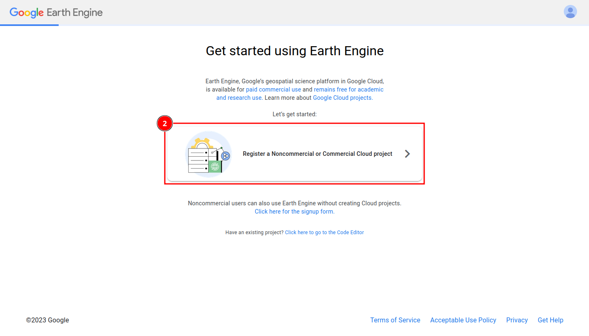
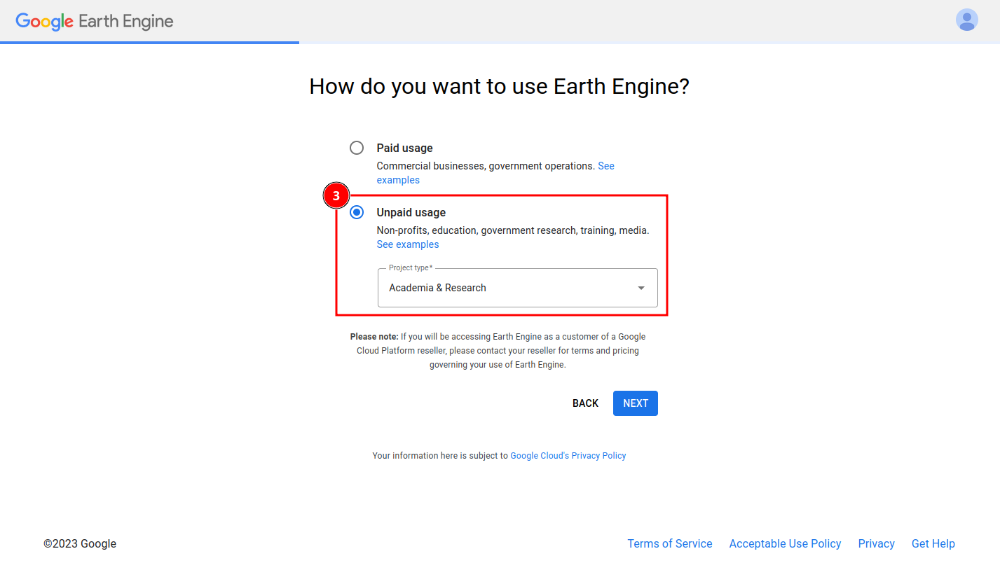
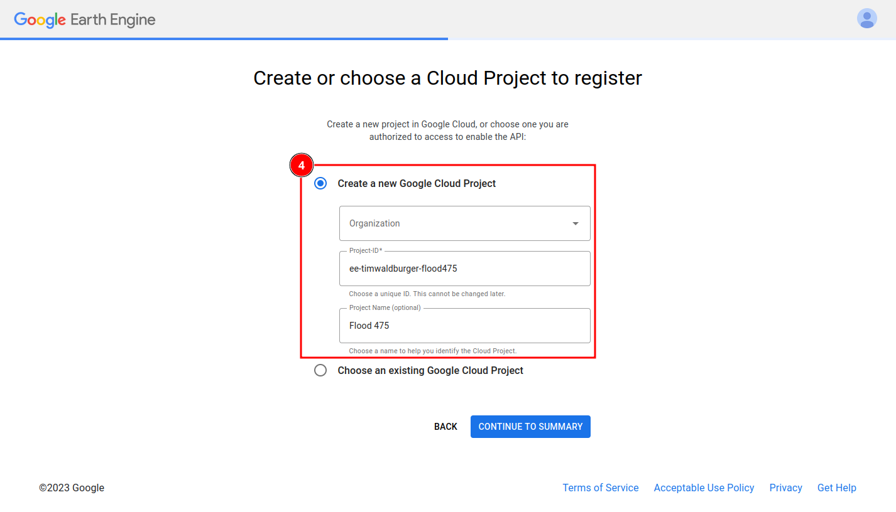
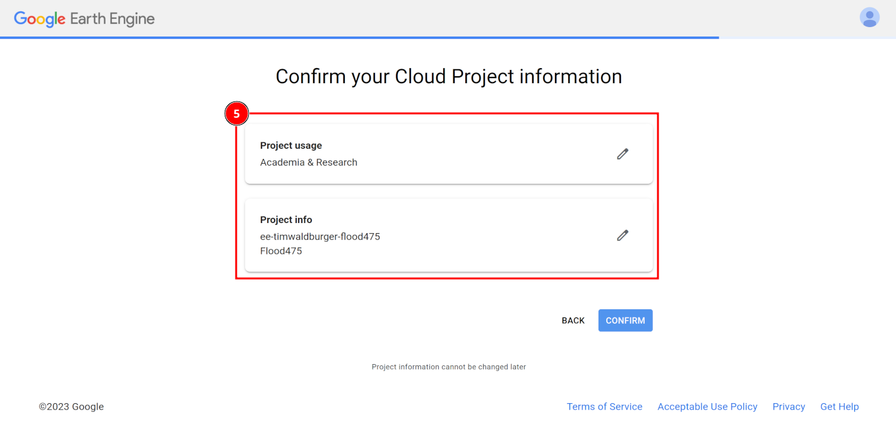

# GEO475 - Flood prediction with Google Earth Engine

## About this exercise
The goals of the exercise are that you:
- get an introduction to ML-based flood modelling, 
- gain a first impression of Google Earth Engine and geemap, and
- get a high-level understanding of how a simple flood model is trained and applied using Python.

For this exercise, you  will need:
- a Google account,
- access to Google Colab,
- access to Google Earth Engine, and
- an active internet connection.

The [next section](#Preparations) guides through the account setup which takes about 20 minutes. Please complete all 4 tasks in [Preparations](#Preparations) before 16.12.2024.

---

## Preparations 

### Create a Google account
You can use your existing Google account if you already have one. If not, please visit [this Google support page](https://support.google.com/accounts/answer/27441?hl=en) and follow the instructions to create a new  account.

### Sign up for Google Earth Engine
1. Visit the [GEE registration page](https://code.earthengine.google.com/register) and sign in with your Google account.
2. Click on _Register a Noncommercial or Commercial Cloud project_.  

3. Mark _Unpaid usage_ and select _Academia & Research_ from the project type dropdown. Then, proceed by clicking on _Next_.  

4. Click on _Create a new Google Cloud Project_. You can leave the organization field blank. Choose a meaningful project ID and name. Note down the project ID - we will need it again later. Proceed by clicking on _Continue to Summary_.  

5. Check you project settings and finish the setup by clicking on _Confirm_.

6. You are now forwarded to the [GEE code editor](https://code.earthengine.google.com/). You can use it to directly interact with the Google Earth Engine by typing commands in JavaScript. However, we will not use the JavaScript code editor in our session but access GEE from a Python notebook for which we will set up Google Colab access in the next steps.

### Sign in to Google Colab
1. Go to the [Google Colab homepage](https://colab.research.google.com/).
2. Sign-in with your Google account by clicking on _Sign in_ in the top-right corner.

### Test your setup
1. Open [geo475_flood_prediction_in_gee.ipynb](https://github.com/twaldburger/flood475/blob/master/geo475_flood_prediction_in_gee.ipynb) here in GitHub.
3. Click on _Open in Colab_ on the very top of the notebook.
4. Update the PROJECT_ID- variable in the first code cell with your project id and run the first code cell. You are good to go if the cell runs without raising an exception.
