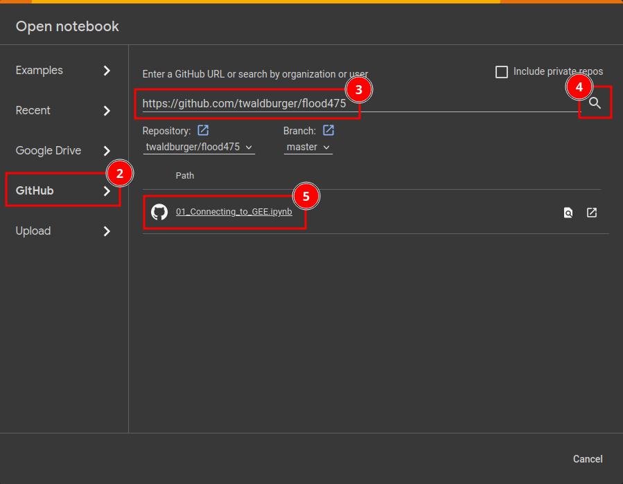

# Flood modelling with Google Earth Engine

## Prerequisites
For this exercise, you  will need:
- a Google account,
- access to Google Colab,
- access to Google Earth Engine, and
- an active internet connection.

The [first section](#Preparations) guides through the account setup. Please complete all 4 tasks in [Preparations](#Preparations) before 11.12.2023.

---

## Preparations 

### Create a Google account
You can use your existing Google account if you already have one. If not, please visit [this Google support page](https://support.google.com/accounts/answer/27441?hl=en) and follow the instructions to create a new  account.

### Sign up for Google Earth Engine
1. Visit the [GEE registration page](https://code.earthengine.google.com/register) and sign in with your Google account.
2. Click on _Register a Noncommercial or Commercial Cloud project_.
3. Mark _Unpaid usage_ and select _Academia & Research_ from the project type dropdown. Then, proceed by clicking on _Next_.
4. Click on _Create a new Google Cloud Project_ and choose a meaningful project ID and name. Note down the project ID - we will need it again later. You can leave the organization field blank. Proceed by clicking on _Continue to Summary_.
5. Check you project settings and finish the setup by clickin on _Confirm_.
6. You are now forwarded to the [GEE code editor](https://code.earthengine.google.com/). You can use it to directly interact with the Google Earth Engine by typing commands in JavaScript. However, we will access GEE from a Python notebook for which we will set up Google Colab access in the next steps.

### Sign in to Google Colab
1. Go to the [Google Colab homepage](https://colab.research.google.com/).
2. Sign-in with your Google account by clicking on _Sign in_ in the top-right corner.

### Test your setup
1. Sign in [to Google Colab.](https://colab.research.google.com/)
2. Choose _GitHub_ in the _Open notebook_-window.
3. Enter the following GitHub URL: _https://github.com/twaldburger/flood475_.
4. Press on the magnifying glass to search the repository for notebooks.
5. Select the notebook named _01_Connecting_to_GEE.ipynb_.
6. Go through the notebook and run each cell. Colab will warn you that the notebook was not created by Google - please confirm by clicking _Run anyway_. If you can run all cells without getting any errors, you are all set up. 

